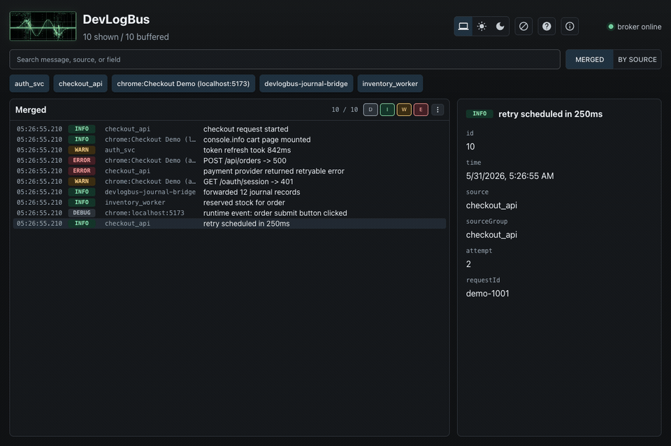

# DevLogBus Documentation

DevLogBus is a local-first structured log bus for development work. It lets
backend services, CLIs, Linux journal streams, and browser debugging events land
in one live stream so a developer can see cause and effect without stitching
together five terminals and a browser console.

DevLogBus is not a production observability platform. It does not provide
retention, alerting, metrics, tracing, multi-user auth, or a hosted cloud
backend. The design center is a single developer or trusted workstation during
active debugging.

## Start Here

- [Quickstart](quickstart.md): download binaries, run the daemon, open the UI,
  emit a test record, and install Browser Tap without Go or Node.
- [Daemon](daemon.md): runtime model, endpoints, settings, replay buffers,
  health/about endpoints, systemd, and troubleshooting.
- [Browser UI](browser-ui.md): merged view, by-source view, Chrome source
  groups, popouts, blocked sources, clear, expunge, help, and about.
- [TUI](tui.md): terminal viewer modes, source grouping, filters, replay, and
  keyboard controls.
- [CLI](cli.md): `emit`, `tail`, `tui`, `endpoint`, `expunge`, `version`,
  `buildinfo`, settings, and shell completions.
- [Browser Tap](browser-tap.md): Chrome extension install, debugger permission,
  capture surface, redaction, source grouping, and local publish path.
- [Journal Bridge](journal-bridge.md): Linux journald capture, match filters,
  source mapping, replay, and endpoint handling.
- [Go SDK](go-sdk.md): `protocol`, `client`, `sloghandler`, and runtime control
  packages.
- [HTTP API and Wire Protocol](http-api.md): record schema, HTTP endpoints, SSE,
  expunge, replay, and socket envelopes.
- [Examples](examples.md): Go, Node/TypeScript, Python, and browser workflow
  examples.
- [Configuration](configuration.md): public endpoint and source conventions.
- [Security and Privacy](security-privacy.md): local-first behavior, Browser Tap
  data handling, safe usage, and exposure risks.
- [Compatibility](compatibility.md): v1 compatibility expectations for records,
  HTTP API, SDKs, CLI, and extension behavior.

## Release And Publishing Notes

- [Linux](linux.md): Linux install, systemd, and journald bridge notes.
- [Windows](windows.md): Windows install and platform limitations.
- [Package Managers](package-managers.md): Homebrew formula generation and
  future package-manager notes.
- [Browser Tap Chrome Web Store Prep](browser-tap-store.md): listing text,
  privacy statement, permission explanations, screenshots, and reviewer notes.
- [Browser Tap Privacy Policy](browser-tap-privacy.md): public privacy policy
  for the Chrome Web Store listing.

## Visual Overview

The usual workflow is:

1. Start `devlogbusd`.
2. Open the embedded browser UI or terminal UI.
3. Publish backend/service logs through the Go SDK, HTTP API, or CLI.
4. Attach Browser Tap to the active Chrome tab when browser-side events matter.
5. Split noisy streams by source, drill into browser source groups, hide or
   block noise, and expunge only when replay-buffer records should be deleted.
