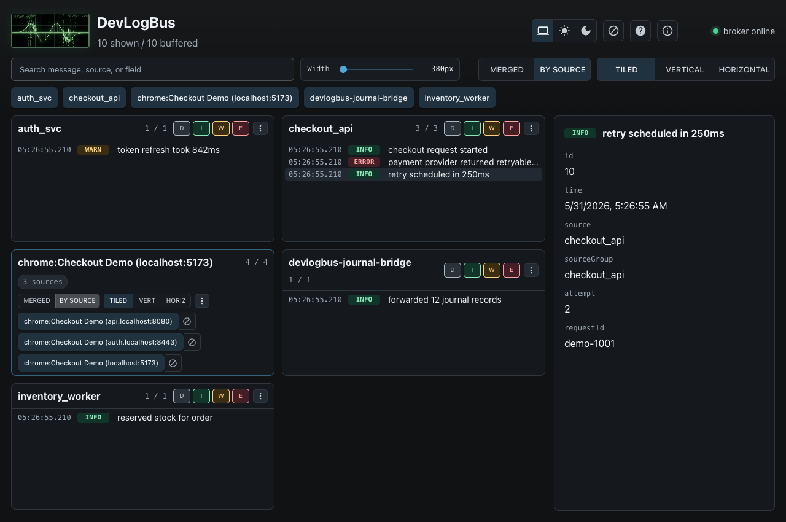

# Introducing DevLogBus

DevLogBus is a local-first structured log bus for development work.

It exists for the part of debugging where the signal is scattered across service
logs, CLI output, Linux `journald`, browser console messages, runtime
exceptions, network events, and whatever else decided to be important today.

Instead of stitching together five terminals and a browser console, run a local
daemon, publish structured records, and watch one live stream in the browser UI
or terminal UI.



## The Short Version

DevLogBus gives local development workflows one place for:

- backend and service logs
- CLI and terminal UI records
- Chrome console, runtime, browser log, and network events
- Linux `journald` records
- records published through Go, C, .NET/C#, Rust, Java/Kotlin, Node/TypeScript,
  and Python SDKs

It is not a production observability platform. It does not try to provide
retention, alerting, metrics, tracing, multi-user auth, or a hosted backend.

It is for workstation debugging, private dev boxes, trusted lab networks, and
active troubleshooting sessions where you need cause and effect now.

## Install Fast

Homebrew on macOS or Linux:

```bash
brew install dan-sherwin/tap/devlogbus
```

Scoop on Windows:

```powershell
scoop bucket add dan-sherwin https://github.com/dan-sherwin/scoop-bucket
scoop install devlogbus
```

Debian or Ubuntu:

```bash
echo "deb [trusted=yes] https://dan-sherwin.github.io/devlogbus-linux-repo/apt stable main" | sudo tee /etc/apt/sources.list.d/devlogbus.list
sudo apt update
sudo apt install devlogbus
```

Other install paths are documented in [Package Managers](package-managers.md).

## Start It

```bash
devlogbusd run
```

Then open:

```text
http://127.0.0.1:7423/
```

Emit a test record:

```bash
devlogbus emit --source demo --level warn --message "catalog unavailable" --attr service=billing
```

## Browser Plus Backend

Browser Tap is the Chrome extension companion for DevLogBus. Attach it to a tab
when browser-side events matter, and it can publish console calls, runtime
exceptions, browser log entries, and network request records into the same local
stream as backend services and CLI tools.

That is the main point: the button click, the frontend error, the backend log,
and the system journal entry can land in one timeline instead of living in
separate little caves.

## SDKs

SDK install commands are collected in [SDK Install](sdk-install.md).

Published packages are available for:

- Go module packages in `github.com/dan-sherwin/devlogbus`
- npm: `@dan-sherwin/devlogbus`
- PyPI: `devlogbus`
- crates.io: `devlogbus`
- NuGet: `DanSherwin.DevLogBus.Sdk`
- Maven Central: `io.github.dan-sherwin:devlogbus`

The C SDK is source-distributed for native projects that want a small `libcurl`
publisher.

## User Choice

DevLogBus provides the tools you need to maintain your own security, but it does
not force you to use them. The project publishes checksums, signing keys, and
verification instructions. Use them as you see fit, because I am not your mother
and it is not my job to make sure you wear a damn helmet. That choice belongs to
you.

In short, piss on the electric fence if you want. Just don't act surprised when
physics files a bug report on your ass.

## Links

- Project: [github.com/dan-sherwin/DevLogBus](https://github.com/dan-sherwin/DevLogBus)
- Quickstart: [quickstart.md](quickstart.md)
- Why it exists: [why-devlogbus.md](why-devlogbus.md)
- Package managers: [package-managers.md](package-managers.md)
- SDK install: [sdk-install.md](sdk-install.md)
